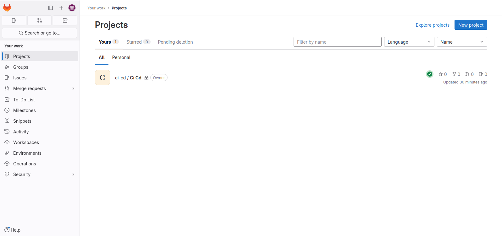
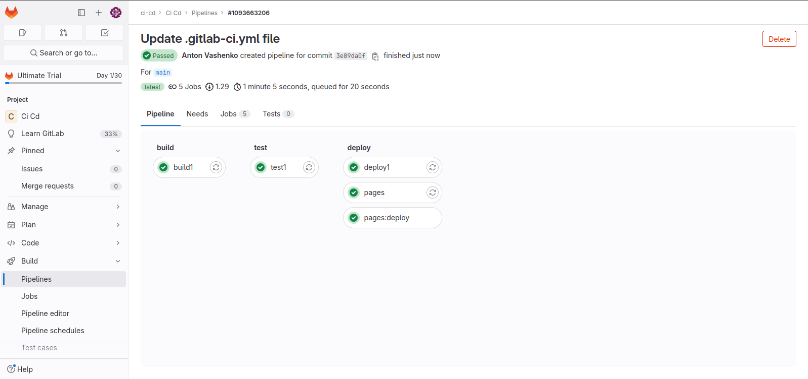
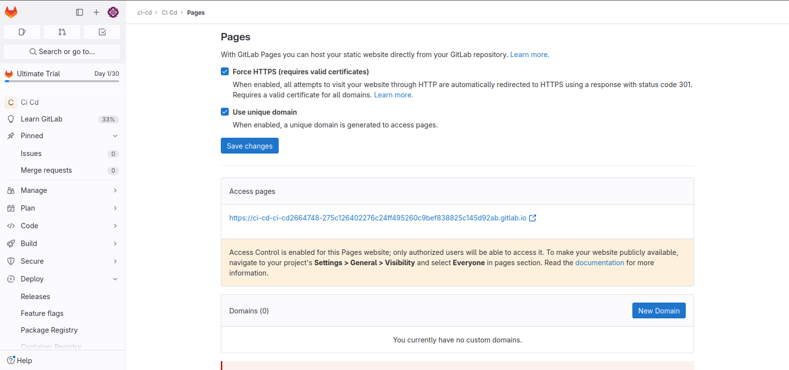

1. Каким-то чудом зарегестрировался на платформе и получил 30 дней пробного периода. Создал пустой проект.

2. Создал в проекте файл с именем `.gitlab-ci.yml` и заполнил его следующим содержимым:
```
image: busybox:latest

stages:
  - build
  - test
  - deploy

build1:
    stage: build
    script:
        - echo "Do your build here"
        - echo one >> file1.txt
        - echo two >> file2.txt
    artifacts:
        paths:
          - file1.txt
          - file2.txt
        expire_in: 30 days

test1:
    stage: test
    script:
        - echo "Do the test here"
        - grep one file1.txt

deploy1:
    stage: deploy
    script:
        - echo "Do your deploy here"
    environment: production

pages:
    stage: deploy
    script:
        - mkdir -p public
        - cp file1.txt public/index.html
        - cp file2.txt public/two.html
    artifacts:
        paths:
            - public
        exclude:
            - public/two.html
    only:
        - main
```
В этом pipeline мы сразу создаем pages и исключаем из него `two.html`. Все стадии пройдены успешно.


3. Переходим в `pages` и переходим по ссылке.




