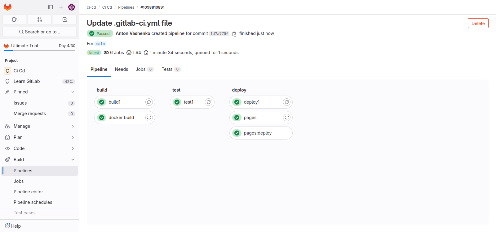
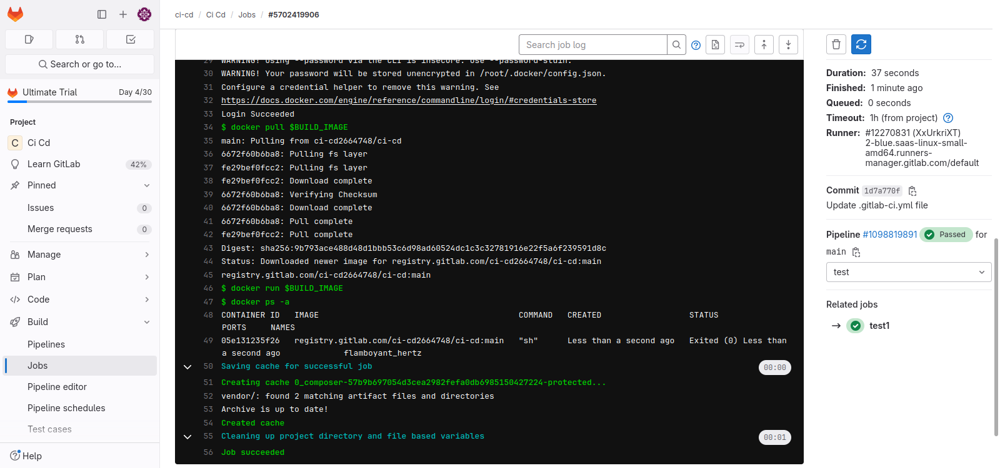

Код файла `.gitlab-ci.yml` для pipline:
```
image: busybox:latest

stages:
  - build
  - test
  - deploy

variables:
    BUILD_IMAGE: $CI_REGISTRY_IMAGE:${CI_COMMIT_REF_SLUG}

cache:
    key:
        files:
            - composer.lock
    paths:
        - vendor/

build1:
    stage: build
    script:
        - echo "Do your build here"
        - mkdir -p vendor/
        - echo "build" > vendor/hello.txt

docker build:
    image: docker:latest
    stage: build
    services:
        - docker:dind
    script:
        - docker login -u $GITLAB_CI_USER -p $GITLAB_CI_PASSWORD $CI_REGISTRY
        - docker build -t $BUILD_IMAGE .
        - docker push $BUILD_IMAGE

test1:
    image: docker:latest
    stage: test
    services:
        - docker:dind
    script:
        - docker login -u $GITLAB_CI_USER -p $GITLAB_CI_PASSWORD $CI_REGISTRY
        - docker pull $BUILD_IMAGE
        - docker run $BUILD_IMAGE
        - docker ps -a

deploy1:
    stage: deploy
    script:
        - echo "Do your deploy here"
    environment: production

pages:
    stage: deploy
    script:
        - mkdir -p public
        - cp vendor/hello.txt public/index.html
        - echo 404 >> public/404.html
    artifacts:
        exclude:
            - public/404.html
        paths:
            - public
    only:
        - main
```
Результаты работы:




