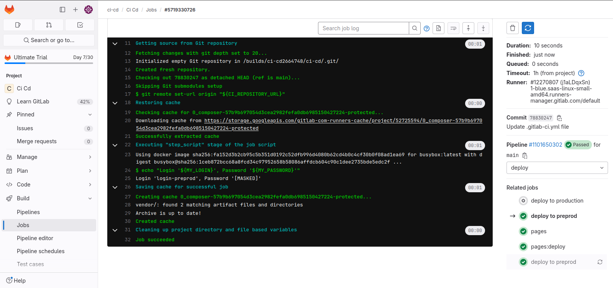

Создал jobs как на семинаре, прописал в них нужные environmens и переменные MY_LOGIN. Переменные MY_PASSWORD создал через настройки проекта в самом gitlab.




Со скриптом остановки всех предыдущих job сам не разобрался, поэтому скопировал из репозитория. Полный код файла `.gitlab-ci.yml`:
```
image: busybox:latest

stages:
  - build
  - test
  - deploy
  - stop
  - cease

variables:
    BUILD_IMAGE: $CI_REGISTRY_IMAGE:${CI_COMMIT_REF_SLUG}

cache:
    key:
        files:
            - composer.lock
    paths:
        - vendor/

build1:
    stage: build
    script:
        - echo "Do your build here"
        - mkdir -p vendor/
        - echo "build" > vendor/hello.txt

docker build:
    image: docker:latest
    stage: build
    services:
        - docker:dind
    script:
        - docker login -u $GITLAB_CI_USER -p $GITLAB_CI_PASSWORD $CI_REGISTRY
        - docker build -t $BUILD_IMAGE .
        - docker push $BUILD_IMAGE

test1:
    image: docker:latest
    stage: test
    resource_group: phone
    services:
        - docker:dind
    script:
        - docker login -u $GITLAB_CI_USER -p $GITLAB_CI_PASSWORD $CI_REGISTRY
        - docker pull $BUILD_IMAGE
        - docker run $BUILD_IMAGE
        - docker ps -a

deploy to preprod:
    stage: deploy
    variables:
        MY_LOGIN: login-preprod
    script:
        - echo "Login '${MY_LOGIN}', Password '${MY_PASSWORD}'"
    only:
        - main
    environment:
        name: preprod
        on_stop: stop to preprod
        auto_stop_in: 1 day

stop to preprod:
    stage: stop
    variables:
        MY_LOGIN: login-preprod
    script:
        - echo "STOP ${MY_LOGIN}"
    only:
        - main
    when: manual
    environment:
        name: preprod
        action: stop

deploy to production:
    stage: deploy
    variables:
        MY_LOGIN: login-prodaction
    script:
        - echo "Login '${MY_LOGIN}', Password '${MY_PASSWORD}'"
    only:
        - main
    when: manual
    environment:
        name: production


cease all jobs:
  stage: cease
  image: everpeace/curl-jq
  script:
    - |
      if [ "$CI_COMMIT_REF_NAME" == "main" ]
        then
          (
            echo "Cancel old pipelines from the same branch except last"
            OLD_PIPELINES=$( curl -s -H "PRIVATE-TOKEN: $RUNNER_TOKEN" "https://gitlab.com/api/v4/projects/${CI_PROJECT_ID}/pipelines?ref=${CI_COMMIT_REF_NAME}&status=running" \
                  | jq '.[] | .id' | tail -n +2 )
                  for pipeline in ${OLD_PIPELINES}; \
                      do echo "Killing ${pipeline}" && \
                        curl -s --request POST -H "PRIVATE-TOKEN: ${RUNNER_TOKEN}" "https://gitlab.com/api/v4/projects/${CI_PROJECT_ID}/pipelines/${pipeline}/cancel"; done
          ) || echo "Canceling old pipelines (${OLD_PIPELINES}) failed"
      fi


pages:
    stage: deploy
    script:
        - mkdir -p public
        - cp vendor/hello.txt public/index.html
        - echo 404 >> public/404.html
    artifacts:
        exclude:
            - public/404.html
        paths:
            - public
    only:
        - main
```
