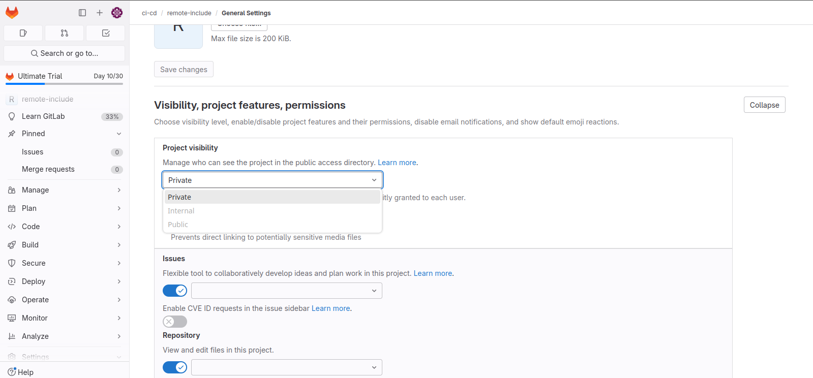
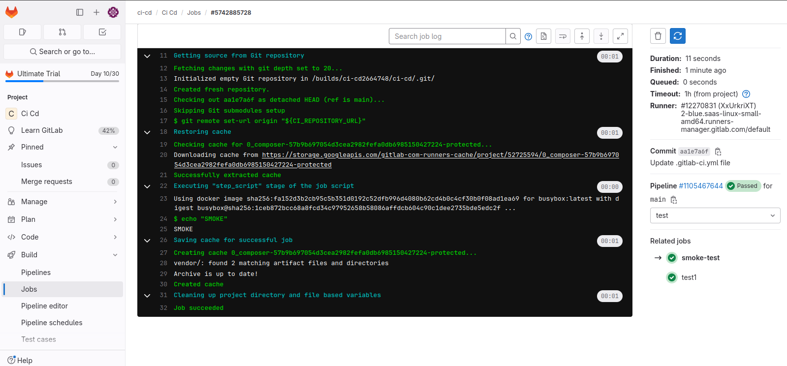

Создал файл с тестовой job в локальном репозитории. Создал новый проект и в нем файл с еще одной тестовой job.

Указал в pipeline первого проекта include.

Однако пробный аккаунт не дает создать public репозиторий, поэтому include не сможет его достать.

Вот результат job без remote include.
